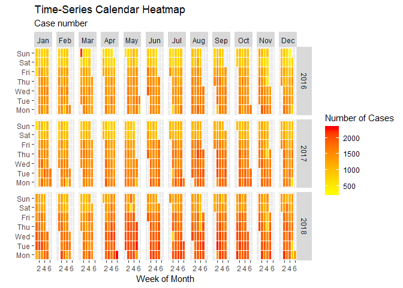

San Fransisco 311 Cases Data EDA
================

311 as the provider of non-emergency municipal services contains a huge amount of useful information that can help the local government in the policy-making process. Here I explored the San Francisco 311 cases data since 7/1/2008 from [DataSF](https://data.sfgov.org/City-Infrastructure/311-Cases/vw6y-z8j6).

Import and Clean Data
---------------------

First, we import downloaded data set.

``` r
sf311 <- read.csv('SF_311_Cases.csv')
```

You can also import the data set from the Socrata Open Data API. This requires the installation of RSocrata library. Due to the size of the data, it will take quite long depending on your internet connection bandwidth.

``` r
install.packages("RSocrata")
library(RSocrata)
sf311 <- read.socrata('https://data.sfgov.org/resource/ktji-gk7t.csv')
```

Then we convert the time in Opened, Closed and Updated columns to *POSIXlt* format which is more convenient to use in R.

``` r
sf311[,2:4] <- lapply(sf311[,2:4], strptime, format = '%m/%d/%Y %I:%M:%S %p') 
```

Data in 2008 and 2019 is not complete, which will introduce bias in monthly cases analysis. Thus only data between 2009 and 2018 is kept for the following analysis.

``` r
sf311_full_year = subset(sf311, Opened$year + 1900 > 2008 & Opened$year + 1900 < 2019)
```

Data Exploration and Visualization
----------------------------------

First, I'd like to see what is the most popular method people use to submit 311 requests and how it changes over time. geom\_bar() chart is used to show the number of cases from every source from 2009 to 2018.


We can see the total number of cases increases every year and the speed is very fast for the most recent 3 years. The main driven force is the *Mobile/Open311*. Although the mobile 311 app launched in 2010 \[1\], the *Mobile/Open311* quickly replaced the *Phone* as the most popular 311 request platform in 2016 and its momentum has not stopped yet. The *Phone*, once the most dominant platform, has a very steady number of 311 cases over the years. It is still the second most popular way for citizens of SF to submit 311 requests today. 311 cases from the *Web*, which is in the third place in 2018, has seen a slow but steady increase in the number of cases over the years. Number 4 in 2018, the *Integrated Agency*, was first seen in 2012 and has been quite steady like the *Phone*. All the other platforms have much less number of cases which makes them almost invisible in the figure.

Next we want to find out what are the top categories the people complained.

``` r
library(plyr)
category <- count(sf311, 'Category')
category <- category[order(-category$freq),]
category$Category <- factor(category$Category, levels = category$Category[order(category$freq)])
ggplot(head(category, 10), aes(x = Category,y = freq)) +
  geom_bar(stat='identity',colour="white", fill = 'Orange') +
  geom_text(aes(x = Category, y = 1, label = 
                  paste0("(",round(100*freq/nrow(sf311),2),"%)",sep="")),
            hjust=0, vjust=.5, size = 4, colour = 'black',
            fontface = 'bold') +
  labs(x = 'Category', 
       y = 'Number of cases', 
       title = 'Top 10 SF 311 Case Categories') +
  scale_y_continuous(labels = scales::unit_format(unit = 'k', scale = 1e-3))+
  coord_flip() + 
  theme_bw()
```


We can see that citizens of SF really care about the appearance of their city. Cases in *Street and Side Walk Cleaning* and *Graffiti* categories consists almost half of the total cases.

Working in progress
-------------------

The following is still working in progress. A calendar heat map is generated for the number of cases submitted form 1/1/2009 to 12/31/2018.

``` r
library(lubridate)
library(zoo)
sf311_full_year$Opened.Date <- as_date(sf311_full_year$Opened)
daily_case_count <- count(sf311_full_year, 'Opened.Date')
daily_case_count$weekday <- as.POSIXlt(daily_case_count$Opened.Date)$wday
daily_case_count$weekdayf <- 
  factor(daily_case_count$weekday,levels=c(1,2,3,4,5,6,0),
         labels=(c("Mon","Tue","Wed","Thu","Fri","Sat","Sun")),ordered=TRUE)
daily_case_count$monthf <- 
  factor(month(daily_case_count$Opened.Date),levels=as.character(1:12),
         labels=c("Jan","Feb","Mar","Apr","May","Jun","Jul","Aug","Sep","Oct","Nov","Dec"),
         ordered=TRUE) # finding the month 
daily_case_count$yearmonthf <- factor(as.yearmon(daily_case_count$Opened.Date)) 
#finding the year and the month from the date. Eg: Nov 2018 
daily_case_count$week <- as.numeric(format(daily_case_count$Opened.Date,"%W"))
daily_case_count <- ddply (daily_case_count, .(yearmonthf), transform, monthweek = 1+week-min(week))
recent_3_years <- daily_case_count[year(daily_case_count$Opened.Date) > 2015,]
```



Some of the 311 requests have associated picture attachment. It may be interesting to see if this additional information will help to improve the resolution rate of 311 requests. We are also curious about whether the picture attachment rate actually affects the resolution rate of 311 requests submitted from different platforms.

``` r
with_url <- sf311[sf311$Media.URL != '' ,]
with_url_resolution_rate <- nrow(with_url[with_url$Status == 'Closed',])/nrow(with_url)
total_resolution_rate <- nrow(sf311_full_year[sf311_full_year$Status == 'Closed',])/nrow(sf311_full_year)
source_info <- unique(sf311_full_year$Source)
resolution_rate_by_source <- data.frame(Category = factor(source_info),
                                        Resolution.Rate = double(8),
                                        Url.Rate = double(8))

for(i in source_info){
  reso_rate = nrow(sf311_full_year[sf311_full_year$Status == 'Closed'&
                                     sf311_full_year$Source ==i,])/
    nrow(sf311_full_year[sf311_full_year$Source ==i,])
  url_rate = nrow(with_url[with_url$Source == i,])/
    nrow(sf311_full_year[sf311_full_year$Source ==i,])
  resolution_rate_by_source[resolution_rate_by_source$Category==i,] <- c(i,reso_rate,url_rate)
}
```

References
----------

\[1\] \[Mobile phone app connects citizens directly to city services\](<https://www.citysourced.com/blog/citysourced-integrates-san-franciscos-open-311-system/>)
